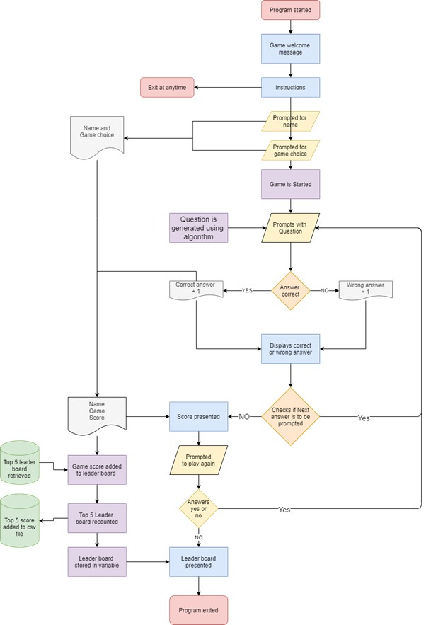

# Readme - Sebastian Teisen

### R3
## Reference List
-	Ruby-Doc.org n.d., Ruby-Doc.org: Documenting the Ruby Language, ruby-doc.org, viewed 18 September 2021, <https://ruby-doc.org/>.
-	RubyGems.org 2016, colorize | RubyGems.org | your community gem host, rubygems.org, viewed 28 September 2021, <https://rubygems.org/gems/colorize/versions/0.8.1>.
-	― n.d., ordinal | RubyGems.org | your community gem host, rubygems.org, viewed 29 September 2021, <https://rubygems.org/gems/ordinal/versions/1.0.0/dependencies>.
-	― 2020, tty-font | RubyGems.org | your community gem host, rubygems.org, viewed 29 September 2021, <https://rubygems.org/gems/tty-font/versions/0.5.0>.
-	― 2021, smarter_csv | RubyGems.org | your community gem host, rubygems.org, viewed 29 September 2021, <https://rubygems.org/gems/smarter_csv/versions/1.2.6>.
-	STATUS UPTIME CODE DISCUSS STATS BLOG ABOUT HELP RubyGems.org n.d., Guides - RubyGems Guides, guides.rubygems.org, viewed 1 October 2021, <https://guides.rubygems.org/>.
-	zonker 2010, Writing a Simple Bash Script, Linux.com, viewed 2 October 2021, <https://www.linux.com/training-tutorials/writing-simple-bash-script/>.

### R4
## Source Control
<add url here>

### R5
## What will the app do?
The 100mm Harry is a maths brain trainer, intended for tradies and anyone else that works with a tape measure. As a tradie myself I understand that when calculating measurements most of time it will be in mm. As such I have designed this game to contain sums more alike to what I would find in the day to day of work on a construction site. 100mm Harry, named after the most common miscalculation on site and consists of three games. The first is called free and is a free player mode which presents nearly never-ending math questions. The second is called Speed and is like free but is timed, with the aim to get as many correct questions as possible before the time runs out. The third is called Brain Teaser which expands on free with an extra number to calculate, also the game gets increasingly harder with every correct answer. If the answer is wrong, the game is over.
## Problem it solves 
As a carpenter I always must make small math calculations in my head. The faster the better, getting my phone out to do calculations slows down my work. These calculations even though simple can easy be wrong when working hard on a construction site, and if wrong can cause big mistakes e.g. a 100mm harry is a common mistake. Practice makes perfect.

## Target audience
I created this app with myself in mind, but anyone else who must do calculations in milometers would benefit.
## How to use
The game can be played through your terminal as an app. Firstly it will need to be cloned from GitHub, then a bundler will need to be installed by entering in the terminal “gem install bundler”. This will automatically install any required gems. Once in the game you will be prompted to enter your name then the game that you wish to play. Strait away the questions will be displayed along with a prompt for your answer, which is checked and a reply of correct or wrong will be displayed, this will repeat for every question. At the end the game the score will be presented, and you will be asked if you want to play again. If true, the game will start from the beginning. Otherwise, the leader board will be presented, and the game will end.

### R6	
## 1. Name prompt
-	The receiver_name() method is called which then calls the name_get() method, this is done so that if their is an error it will be caught in the reciver_name() method.
-	The name_get() method displays a message to the user by using puts.
-	This message first details access to the help file containing the game instructions and states that it can be accessed at any point in the game. Then a requests is made for the users name. 
-	The message Utilizes gets.strip.upcase to get the users input, strips the excesses white space in the users name then upcases it ready for presentation to the leader board. 
-	The name as a value is returned to the receiver_name() method then stored in a variable called player
-	If no name is not entered, rescue in the receiver_name() method will be triggered and calls on the NoName class. This has been created as a subclass of standard input, the NoName class outputs a custom message telling the user that nothing has been entered and will loop, using retry in the receiver_name(), back to the gets.strip.upcase until the user either enters a name or exit.
-	If input = help, the help() method will be called and through the help_out() method a message will be .puts to the screen detailing the users help options such as using ‘exit’

## 2. Game prompt
-	The game prompt utilizes the same classes and methods as game name
-	It also includes a raise error in the get_game() method, when triggered it calls the NoGame class, which puts a message stating no game name entered and loops until the user inputs the correct game name or the user enters exit.
-	When the correct name is entered, the value is retuned to the variable ‘input’
The input variable is checked against the three game options.
-	The game name that matches will be started.

## 3.	Free play
-	Once the game name is entered the feature starts. 
-	There are three individual question games with their own unique features but are all based on the first game “free play”.
-	The game displays a math question to the user, the user enters an answer, the answer is checked and a reply of correct or wrong is displayed to the screen.
-	Due to the fact that this is a math question game there is no need to add an error function for the users answers, because there can only be one correct answer as a integer converted form a string, everything else is marked as wrong.
-	The users name and total correct answers are tallied and displayed at the end of every game and stored to a csv file in a leader board.
-	The game function works by iterating over an array of numbers.
-	For each iteration the corresponding index value is stored in the variable between the pipes, also a sample is retrieved from the same array giving a random number. 
-	These two numbers are added together and the value is stored in a variable.
-	The math question is displayed as a string using interpellation with two values.
-	Then using gets.chomp the users answer is retrieved and stored in a variable.
-	The screen is cleared using system ‘clear’
-	One is added to the count variable, which is counted against the length of the array, once the end of the array is reached this count will be used to display the total score.
-	Then the check_answer() method is used to check the answer, whether the question and answer matches.
-	If they match “correct” in cyan color will be display if not “wrong” in red will be displayed.
-	If the score was correct a point will be added to the score for creating the score board.

## 4.	Speed
-	The speed game is built upon the free play game however it is timed.
-	This is achieved by using a while loop and the Time class to assign the current time to a variable then adding the number of seconds that the game will play.
-	Once the current time is greater than the while loop time variable. A message stating ‘Times up’ will be displayed to the screen and the loop will break.
-	Then the same score functions as on free play will be triggered. 
-	It also contains an extra function which changes the math question as the count rises using an if else statement. 

## 5.	Brain Teaser
-	Brain teaser is also built upon the free play game, however it has an extra number to calculate.
-	This is achieved by sampling a value from the numbers array twice, storing it in a variable, then the next round using that same value and to it again by using the same sampling method. Which is stored and repeated each round to increase the difficulty of the question.
-	This game differs in the fact that if an answer is wrong the game ends by using a if/else statement, where the else statement is the default for a wrong answer contains a break.
-	Then the normal score board functions the same as free play will commence.

## 6.	Score board 
-	The score board is presented at the end of every game and display the name of the user the number correct wrong answers.
-	This is achieved by storing a point in a variable for either a correct or wrong answer.
-	Then the values are retrieved along with the users name, which was retrieved at the start of the game using the name_reciver() method and stored in a variable.
-	These three values are applied to a string using interpellation and printed to the screen.

## 7.	Replay game options
-	At the end of the game an option to replay the game will be presented using the good_bye()
method
-	This method prompts the user to enter either y/n to continue or exit the game.
-	The error function for this prompt will cause it to loop until they enter y or n, the user can also exit at any time.
-	If the user enters “y” the game will commence from the start again.
-	If they enter “n” the game will end, and the leader board will be presented.

## 8.	Leader board 
-	The leader board comprises of the score boards displayed at the end of every game 
-	It is a compiled list of the top 5 scores and is displayed when the game is exited.
-	The top 5 previous games score boards are saved to a csv file specific to the game and are retrieve at the end the game.
-	If there is an error when retrieving form the csv file there will be an error message displayed telling the user to check if the file is stored correctly, then will exit the game automatically.
-	Once retrieve the new score is added then they a reshuffled with the highest score at the start and the smallest score at the end.
-	After this the scores hash length is checked if it is greater than 5, if true the last score is removed. This will loop until the leader board only contains 5 score boards and is part of error handling a list greater than 5.
-	These top 5 score boards are stored as a hash of hashes in the game specific csv file. This is done by identifying the assigning game name as the key and the score board as the hash value.

### R7
## How to use 
The game is very simple to use, the installation guide is contained in the readme file which details the requirements for installation. Also, when the game first loads it displays the options of entering “help” to get the game instructions at any time or “exit” to exit at any time. These instructions include information about how to properly install the game, the requirements to run it, the game options and how to navigate through the game. Next there is a prompt for the users to enter their name. If nothing is entered the error class NoName will be called which displays a string stating that no name has been entered and will loop back to prompt for another name. Then the three games options will be displayed and a prompt for the user to enter one of the games to play. If nothing is entered or an incorrect game name is entered, the error class NoGame will be called and display a message stating that one of the game names must be entered to continue, then loop back to the game prompt. Once the game commences it displays math questions which the user enters an answer to see if its correct. Game 1 is Free play which repeatedly presents math questions and repeats this until the end of the game. It is intended as an easier less stressful option. Game 2 is called speed and is similar to free play but is timed creating a more intense experience for the user. Game 3 is called Brain Teaser and presents more challenging questions, with the aim of getting as many correct in a row. Once an answer is wrong the game ends. At the end of every game the score board is displayed showing the users name their score. After which the option to replay the game will be given. If replayed the game will start as normal, if not the game will end, and the Leader board will be displayed showing the top 5 score boards for that specific game. The errors handling for this game, such as at the name prompt, the game prompt and the replay prompt will simply rely on a loop. Giving the player multiply goes at re-entering the correct input. The file loading error handling will display a message to the user to make sure the leader board file is contained inside the folder. Then the game will automatically exit instead of simply crashing. If the csv file is not present it only affects the user’s ability to view the leader board and store new scores. The game can be restarted and replayed as usual without this affecting it.

### R8

### R9
## Trello Board
<https://trello.com/invite/b/C2UzeJH6/593cc8b208568ff1dc1a37f46edc13c5/maths-app>
### R10
## Dependences 
100mm Harry is a ruby develped app and requires ruby to be installed before running this application, also this app requires the below stated gems. They will be automaically installed by entering bundle install into your terminal:
- ### Gem:  "colorize", "~> 0.8.1" 
- ### Gem:  "ordinal", "~> 1.0"
- ### Gem:  "tty-font", "~> 0.5.0"
- ### Gem:  "smarter_csv", "~> 1.2"
